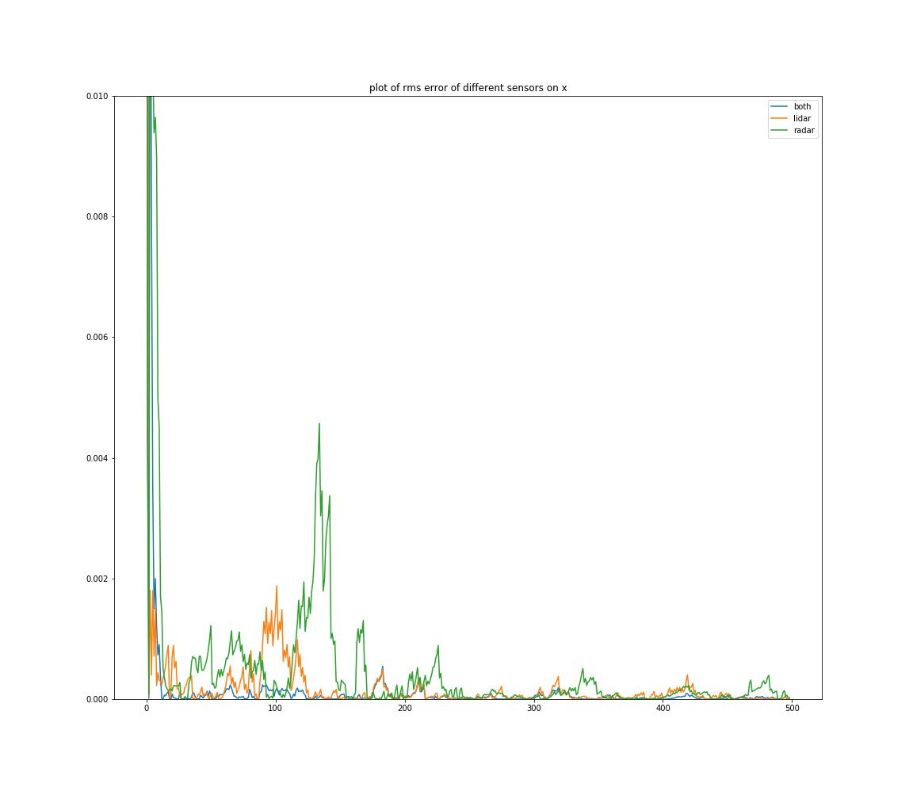
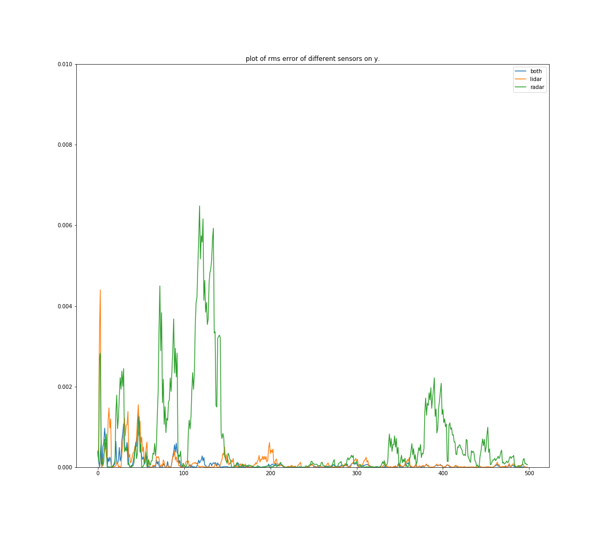
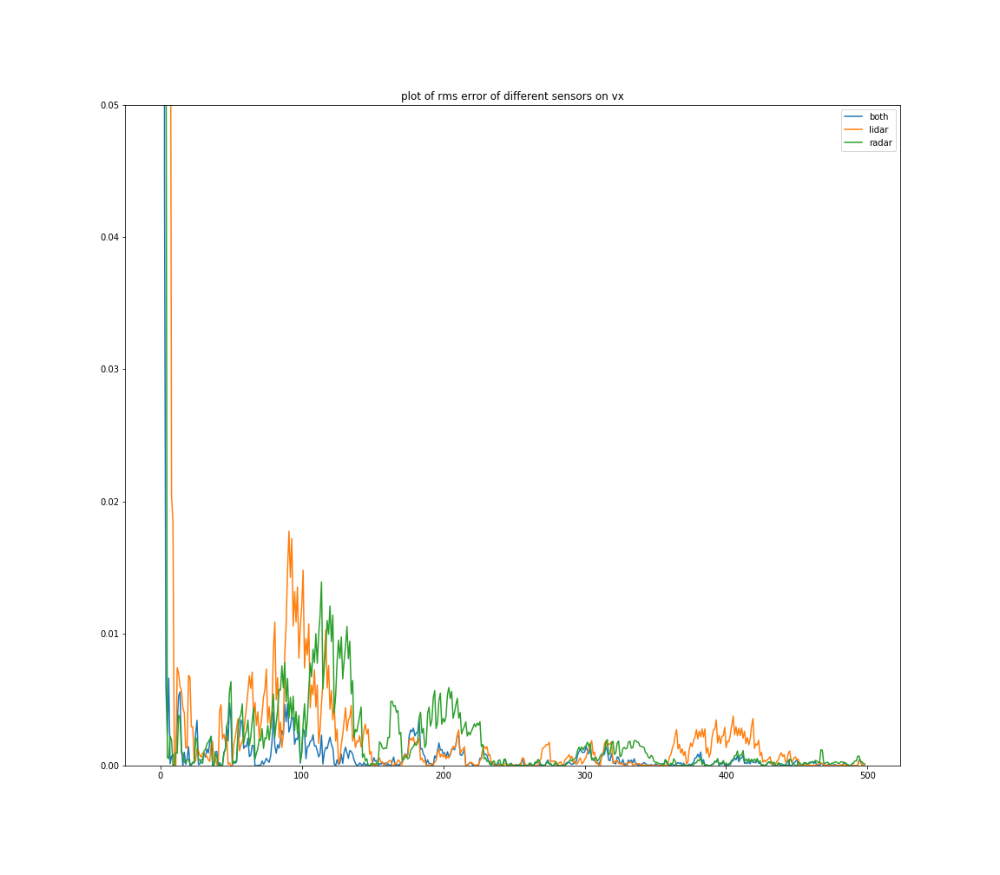
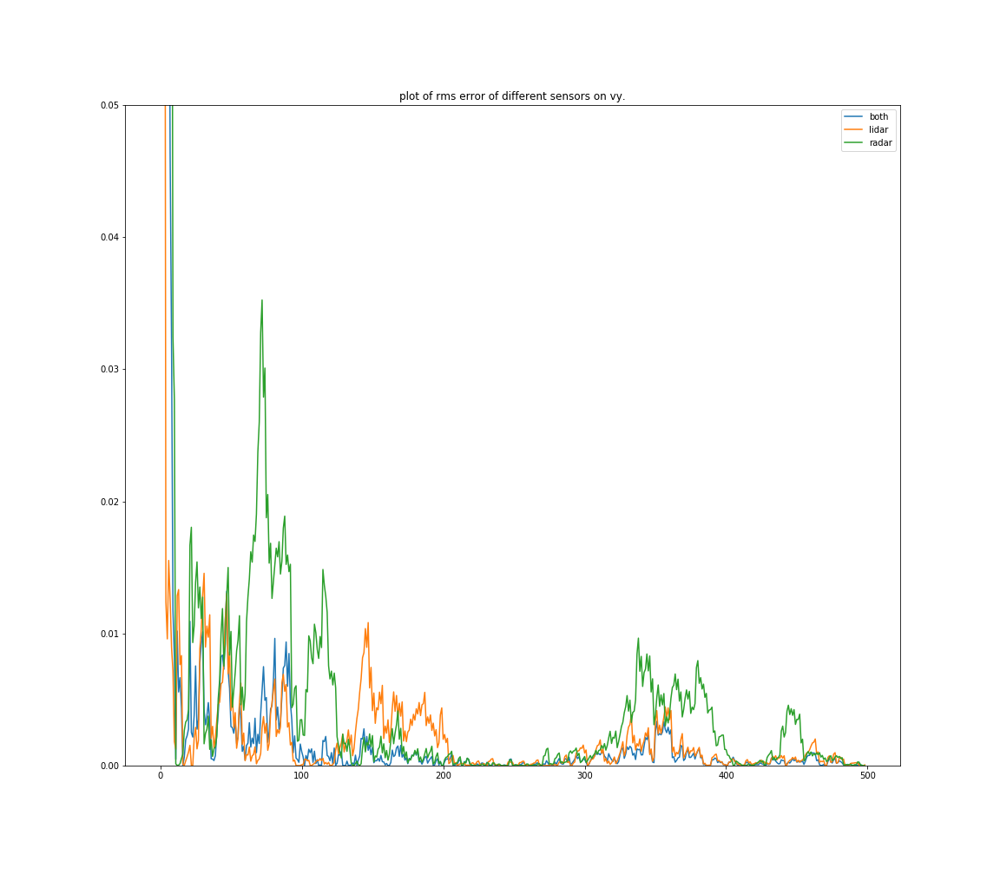

This file contains the analysis portion of this EKF sensor fusion project. I ignored the lidar and radar 
measurement updates separately to observe the impact on the tracking error.

The charts below recorded the RMS error of the tracked vehicle throughout its trajectory. Obviously, 
the sensor fusion version works best in all situations. For a pure lidar KF, it is evident in the charts
that it outperformed on position but is less accurate in terms of velocity than the radar EKF. However,  
the weakness in the Radar is that when the tracked vehicle starts to be move tangential to the sensor,
(around frame 50), the RMS spikes for vy, px and py. This is due to the radar only observing radial velocity.

I think 

